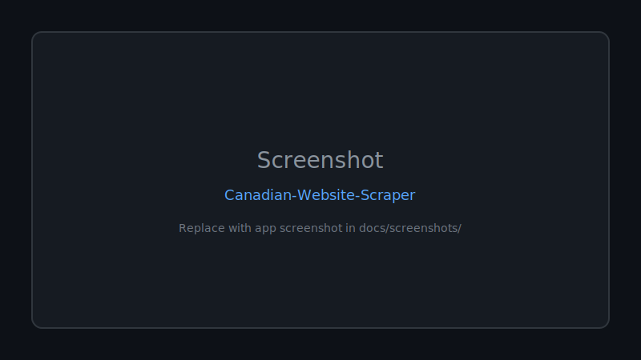

<div align="center">

# 🚀 Canadian Website Scraper

**A python Playwright Scrapper used to scrap Canadian Study website including encrypted Voices, Text, MCQS, Pictures and make a replica website**

Documented · MIT licensed · Maintained

[](https://nodejs.org/)
[](LICENSE)
[](CONTRIBUTING.md)

[Features](#-features) · [Quick Start](#-quick-start) · [Screenshots](#-screenshots) · [Contributing](CONTRIBUTING.md)

</div>

---

## 🖼 Screenshots



*Replace `docs/screenshots/placeholder.svg` with real app screenshots.*

---

## 🐍 Contribution graph


<picture>
  <source media="(prefers-color-scheme: dark)" srcset="https://raw.githubusercontent.com/mafzalkalwardev/Canadian-Website-Scraper/output/snake-dark.svg" />
  <source media="(prefers-color-scheme: light)" srcset="https://raw.githubusercontent.com/mafzalkalwardev/Canadian-Website-Scraper/output/snake.svg" />
  
</picture>


---

Local TEFSuccess scraper and quiz website for **Muhammad Awais Success Web**. The scraper logs into [tefsuccess.ca](https://tefsuccess.ca), captures quiz review pages with Playwright, and builds a static practice site deployed to Vercel.

## Setup

```bash
npm install
```

## Credentials

Never commit credentials. Use environment variables only:

```powershell
$env:TEF_USERNAME="your-email@example.com"
$env:TEF_PASSWORD="your-password"
```

## Full refresh (scrape → build → deploy)

Re-scrapes all quizzes (auto-completing attempts when answer keys are missing), refetches reviews, scrapes Expression écrite/orale pages, rebuilds `public/`, and deploys:

```powershell
npm run refresh:all
```

Rebuild and deploy from the latest scrape without re-scraping:

```powershell
npm run refresh:build
```

## Individual commands

| Command | Purpose |
|---------|---------|
| `npm start` | Local server at http://localhost:3000 |
| `npm run scrape:tef` | Scrape only (via `scrape.py`) |
| `npm run refetch:reviews` | Re-download review pages for mocks missing answer keys |
| `npm run scrape:production` | Scrape Expression écrite/orale study pages |
| `npm run rebuild:public` | Rebuild `public/data/course.json` from latest export |
| `npm run deploy:vercel` | Deploy `public/` to Vercel |

## Live site

https://awais-ahmed-success-web.vercel.app

## What gets scraped

- **Compréhension écrite** — 21 mock quizzes
- **Compréhension orale** — 20 mock quizzes (audio + images)
- **Expression écrite / orale** — introduction and section study pages
- Correct answers from completed Moodle review pages (auto-submits attempts when needed)

## Checks

```bash
npm run check
```
